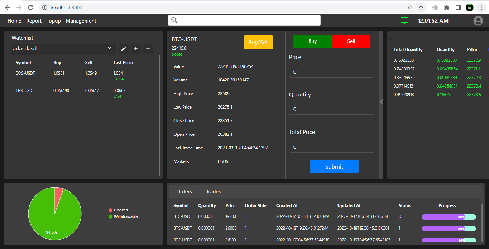

# Online Trading Platform Documentation

## Overview

This documentation provides an overview of the architecture, technologies, and features implemented in the creation of the online trading platform. The platform primarily focuses on real-time market data, order management, and user interaction through a web-based interface.

### Technologies Used

- **React:** Utilized as the core framework for building the frontend user interface.
- **Redux:** Implemented for managing application state and data flow within the React components.
- **Websockets:** Employed to establish real-time communication with the backend server for market data updates and order management.
- **Functional Components:** React's functional components used extensively for UI development.
- **CSS Modules:** Utilized for styling components, ensuring encapsulation and modularity.
- **Bootstrap:** Leveraged for responsive design elements and UI components.
- **Custom Hooks:** Developed custom hooks to encapsulate logic and reuse functionalities across components.

## Features

### Real-time Market Data

The platform integrates with RESTful APIs and utilizes Websockets to fetch and display real-time market data. The Websockets continuously listen for updates, ensuring that users receive immediate information regarding market changes.

### Order Management

Users can perform various order management tasks such as creating new orders or deleting existing ones. These actions are facilitated through the platform's interaction with the backend via RESTful APIs and Websockets.

### UI/UX Design

While the frontend developer has created the frontend from scratch without using a finalized design from Figma, the UI closely aligns with the envisioned design. The interface is designed to be user-friendly, intuitive, and responsive across different devices.

## Technology Stack Details

### React

React serves as the foundational framework for creating a modular, efficient, and scalable user interface. It enables the creation of reusable components and ensures a responsive and dynamic user experience.

### Redux

Redux is employed for managing the application's state, allowing for centralized data management and facilitating communication between components. It helps maintain a consistent application state and simplifies data flow within the platform.

### Websockets

Websockets are used to establish a persistent connection between the frontend and backend, enabling real-time data updates. This technology ensures timely delivery of market changes and order updates to users without the need for constant manual refresh.

### CSS Modules and Bootstrap

CSS Modules are utilized to style React components, providing scoped and modular styling. Bootstrap is incorporated to facilitate responsive design, offering a range of UI components and layout utilities for a consistent user experience across devices.

### Custom Hooks

Custom hooks are developed to encapsulate logic and functionalities shared across multiple components. This approach enhances code reusability and maintains a cleaner and more organized codebase.

## Conclusion

The online trading platform is built using modern frontend technologies, enabling real-time market data updates, seamless order management, and an intuitive user interface. The combination of React, Redux, Websockets, and other mentioned technologies ensures a robust and responsive trading experience for users.
