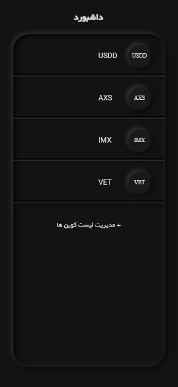
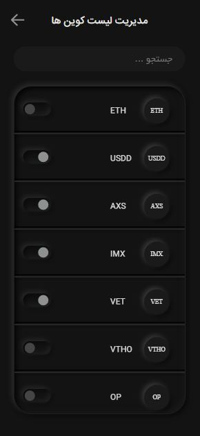

> You'll find the documentation for online trading [here](./OnlineTradingDocs.md)

# Digital Currency Project

This project is a TypeScript challenge code that explicates a portion of a digital currency project. Developed using TypeScript language, React library, and Next.js framework, it leverages technologies such as styled-components, redux-toolkit, and Jest.

## Project Overview

The project focuses on digital currencies, offering insights into their functionality and management. Utilizing RESTful API requests through fetch, it establishes communication with the digital currencies' local data within the project.

To interact with digital currencies and generate legacy addresses for Bitcoin, the project utilizes libraries like bitcoinjs-lib and ecpair.

## Project Workflow

The project operates as follows: Upon landing on the dashboard's initial page, clicking the "Manage Tokens" link navigates users to the `/manage-tokens` route. There, users can select coins, storing their information in the Redux Toolkit's store. These details become accessible and displayable across various components, including the dashboard page.

## Project Structure

The project's folder structure is organized as follows:

- `src`
  - `components`
    - `coin-component`
    - `coin-icon`
    - `list-item-separator`
    - `message-display`
    - `search-input`
    - `toggle-switch`
    - `top-nav`
  - `hooks`
  - `pages`
    - `api`
    - `manage-tokens`
  - `redux`
    - `slices`
    - `store`
  - `services`
  - `themes`
  - `utils`

### Folder Descriptions

- `coin-component`: Contains the `CoinComponent` responsible for displaying a list of tokens based on the provided token array.
- `coin-icon`: Houses the `CoinIcon`, constructing token-specific icons based on the token's name.
- `list-item-separator`: Comprises the `ListItemSeparator` to visually separate coins in the `CoinComponent`.
- `message-display`: Includes the `MessageDisplay` component to showcase specific messages to users based on provided strings.
- `search-input`: Contains the `SearchInput` component for token search functionality and storage.
- `toggle-switch`: Holds the `ToggleButton` component, facilitating the on/off state for token selection.
- `top-nav`: Hosts the `TopNav` component to set the project's layout and create a navbar.
- `hooks`: Contains a custom hook named `useGetAPI`, managing GET requests to the API.
- `pages`: Contains the `Home` component, responsible for retrieving data from local storage, storing it in Redux Toolkit, and displaying it. Also includes `api` and `manage-tokens` folders serving as route endpoints for data retrieval and coin management, respectively.
- `manage-tokens`: Houses the `ManageTokens` component, handling token search, display, selection, and providing a better user experience using the `MessageDisplay` component.
- `redux`: Contains `slices` and `store` folders. The `store` is a unified store for the entire project, while `slices` holds reducers contributing to a better development experience.
- `services`: Organizes the program's logic to prevent clutter within components.
- `themes`: Contains project-specific theme settings.

## Installation and Execution

To install and run the project after cloning it from GitHub, follow these commands:

1. **Install:** `npm install`
2. **Run:** `npm run dev`